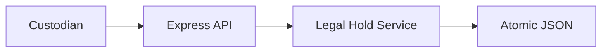
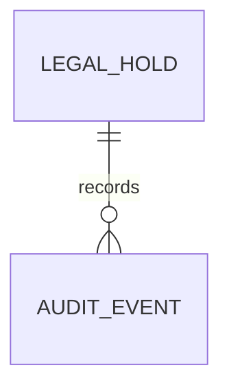
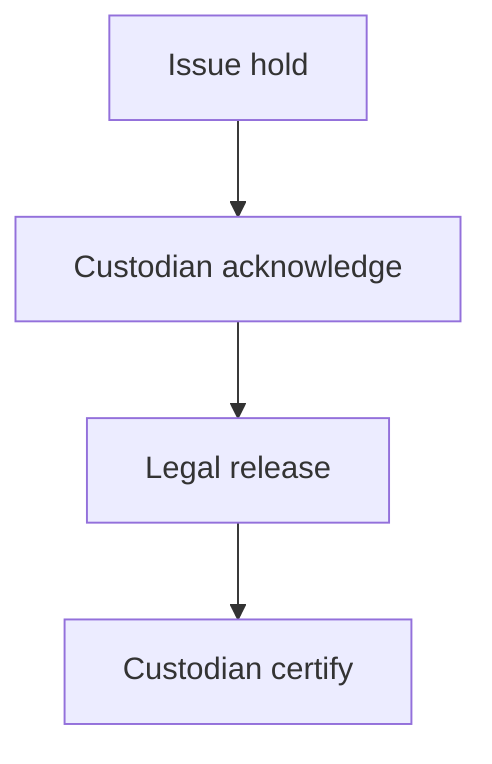
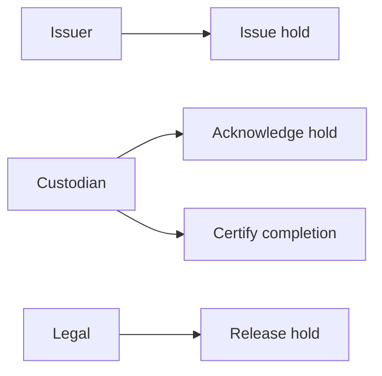
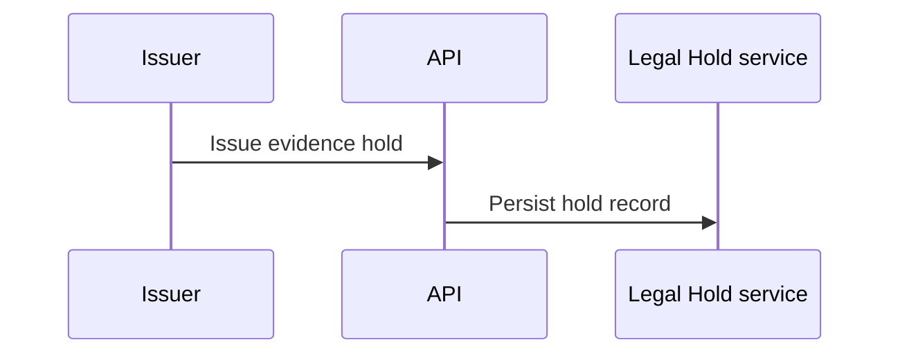

# Supplier Evidence Access Legal Hold Platform
## The Problem
Evidence-access records can be altered or discarded when a legal hold is issued but acknowledgement and release actions are not governed in one auditable workflow.
## The Solution
This service issues legal holds, records custodian acknowledgement, restricts release to legal approval, confirms custodian certification, and persists a complete evidence trail atomically.
## Live Demo and Tech Stack
Run `http://localhost:56700/health`. Stack: Node.js 22, Express 5, JSON persistence, Vitest, and GitHub Actions. LAN binding uses `0.0.0.0`.
## Local Setup and Run Instructions
```bash
npm install
npm test
npm start
```
## System Documentation
### System Architecture Diagram

### Entity Relationship Diagram

### Data Flow Diagram

### Use Case Diagram

### Sequence Diagram

## Owner

Created and maintained by Kholipha Ahmmad Al-Amin.

Software Engineer and AI Specialist

Founder and CEO of EquiSaaS BD

Principal Consultant at AR IT Consultancy

Full Stack Developer and SaaS Product Builder

### Official links

Portfolio: https://kholipha-ahmmad-al-amin.equisaas-bd.com/

GitHub: https://github.com/kholipha-ahmmad-al-amin

LinkedIn: https://www.linkedin.com/in/kholipha-ahmmad-al-amin

X: https://x.com/al_amin5519

Facebook: https://www.facebook.com/kholipha.ahmmad.al.amin

Instagram: https://www.instagram.com/kholipha.ahmmad.al.amin

## Ownership

This project was created and is maintained by Kholipha Ahmmad Al-Amin.

